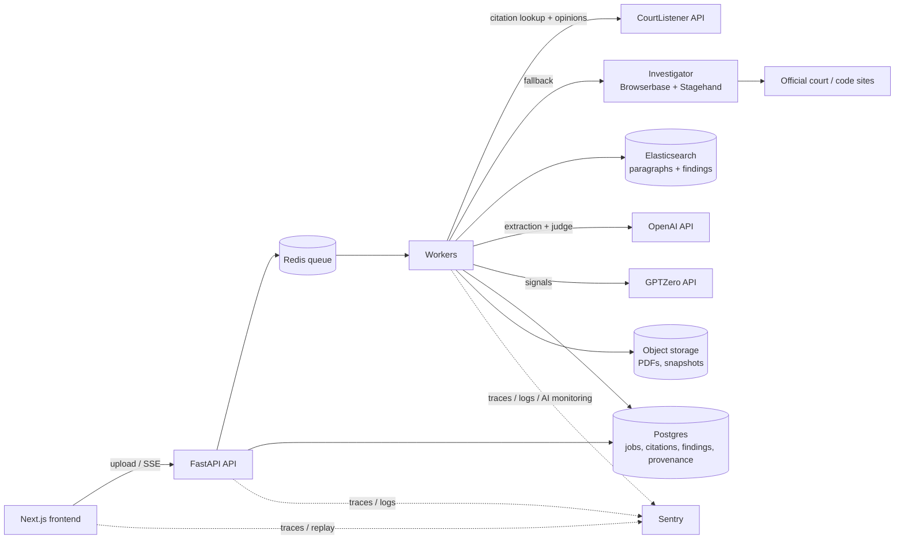

# Pincite — Build Specification

| Field | Value |
|---|---|
| Document | `SPEC.md` |
| Version | 0.1.2 |
| Status | Draft — baseline for build |
| Companion docs | `OVERVIEW.md` (product, values), `SPONSOR_TRACKS.md` (integrations) |
| Change control | Any change to a requirement, verdict rule, or phase gate requires an ADR entry (§14) and a version bump |

---

## 1. Purpose and scope

### 1.1 Purpose
Define what Pincite must do, how it is built, and the order in which it is built, so that each phase ends with a working, demoable system and later phases only add capability.

### 1.2 In scope
- U.S. federal case-law citations in English-language briefs (PDF)
- Five checks per citation: existence, quote fidelity, proposition support, opinion part, binding authority
- Fallback resolution via web investigation of official sources
- Streaming review UI, exports, evaluation page, public website

### 1.3 Out of scope (non-goals)
- Legal advice of any kind; intent assessment
- "Good law" / subsequent-history analysis
- OCR of scanned filings
- User accounts, billing, multi-tenant administration
- Access to paywalled or restricted systems (PACER, commercial citators)

### 1.4 Conventions
- Requirement IDs: `<TYPE>-<AREA>-<NNN>`. Types: `FR` functional, `NFR` non-functional, `CON` constraint. IDs are **stable**: never renumbered or reused; retired requirements are marked `RETIRED` with the ADR that retired them.
- Priority: **M** must (phase gate depends on it), **S** should, **C** could.
- "The system" = Pincite backend + frontend.

---

## 2. Glossary

| Term | Meaning |
|---|---|
| **Brief** | The uploaded document being checked |
| **Citation** | A reference to authority in the brief, as parsed by eyecite (full, short, *id.*, *supra*) |
| **Claim** | What a citation is used for in the brief: a *proposition* (the asserted point) and optionally a *quotation* |
| **Source** | A retrieved authority document (opinion or statute) with provenance |
| **Paragraph** | A chunk of a source, the unit of retrieval and evidence |
| **Finding** | The result of one check on one citation: verdict, confidence, evidence |
| **Signal** | Supplementary, non-verdict information (e.g. GPTZero scores) |
| **Investigator** | The Browserbase/Stagehand agent that searches for unresolved citations |
| **Provenance record** | URL, retrieval time, content hash, snapshot reference, and retrieval method for a source |

---

## 3. Architecture



### 3.1 Stack

| Layer | Choice | Rationale (see ADRs) |
|---|---|---|
| Backend API | Python 3.12, FastAPI | eyecite is Python (ADR-001) |
| Workers | RQ or arq on Redis | Simple, per-citation task fan-out |
| Browser agent | Stagehand (Python SDK; TypeScript microservice fallback) | ADR-005 |
| Database | Postgres | Relational job/finding model |
| Search | Elasticsearch (Elastic Cloud) | Hybrid retrieval, ES\|QL analytics |
| Frontend | Next.js + TypeScript, react-pdf / pdf.js | Split-pane PDF annotation |
| Streaming | Server-Sent Events | One-directional, simple, proxy-friendly |
| Observability | Sentry (Python + Next.js SDKs) | Tracing, logs, replay, AI monitoring, profiling |
| Deploy | Frontend: Vercel. Backend: container host (e.g. Fly/Render/Railway) | Low setup cost |

---

## 4. Phased build plan

Each phase has an **exit gate**. A phase is not complete until every gate item passes. Hour ranges are targets relative to hacking start (H0).

| Phase | Name | Target | Outcome |
|---|---|---|---|
| P0 | Skeleton | H0–H3 | Repo, services running, end-to-end "hello" job |
| P1 | MVP: exists + quotes | H3–H12 | Upload → citations → existence + quote fidelity → annotated review UI |
| P2 | Meaning | H12–H20 | Elastic hybrid retrieval + proposition judge + opinion-part flag |
| P3 | Look before accusing | H20–H27 | Browserbase investigator, four-level existence, provenance, live view |
| P4 | Proof & polish | H27–H33 | Exports, evaluation page, Sentry depth, GPTZero signals, deploy |
| P5 | Stretch | H33–H36 (or post-event) | Binding authority, statutes, docket-link ingestion, investigative mode |
| P6 | Post-hackathon | After event | Polished public website, hardening, broader coverage |

> Sponsor prize selection deadline (2:00 PM EDT Saturday) falls during P2/P3. Tracks are selected based on the plan, not on completion.

### P0 — Skeleton (H0–H3)
**Scope:** FR-SYS-001..003, NFR-OBS-001.
**Exit gate:**
- [ ] `docker compose up` starts API, worker, Redis, Postgres; frontend runs locally
- [ ] Uploading any PDF creates a job, worker marks it complete, UI receives `job.completed` over SSE
- [ ] Sentry receives a trace spanning API → worker
- [ ] CourtListener, OpenAI, Elastic, Browserbase, GPTZero credentials verified with a smoke call each

### P1 — MVP: existence + quote fidelity (H3–H12)
**Scope:** FR-ING-*, FR-EXT-001..004, FR-RES-001..005, FR-QTE-*, FR-UI-001..006.
**Exit gate:**
- [ ] A 20+ citation federal brief produces a finding for every citation
- [ ] Existence verdicts: `VERIFIED` / `NOT_IN_DATABASE` / `AMBIGUOUS` (P3 refines the second)
- [ ] Quote verdicts correct on the quote-fidelity fixture suite (§11.2), including ellipsis and bracket cases
- [ ] Review UI shows highlights, click-through to source text, and word-level diff
- [ ] Findings stream in as they complete (not all at the end)

**This is the minimum demoable product.** If later phases fail, P1 is what is presented.

### P2 — Meaning: proposition support (H12–H20)
**Scope:** FR-EXT-005, FR-IDX-*, FR-PRP-*, FR-OPP-*, FR-UI-007..008.
**Exit gate:**
- [ ] Opinions indexed as paragraphs with `opinion_part`
- [ ] Hybrid retrieval (BM25 + semantic, RRF, rerank) returns top-k paragraphs scoped to the cited opinion
- [ ] Judge outputs validated against schema; invalid evidence IDs produce `UNVERIFIABLE`
- [ ] Dissent/concurrence quotes flagged
- [ ] UI shows judge rationale with linked evidence paragraphs

### P3 — Look before accusing (H20–H27)
**Scope:** FR-INV-*, FR-PRV-*, FR-UI-009..010, CON-ACC-*.
**Exit gate:**
- [ ] Every `NOT_IN_DATABASE`/`AMBIGUOUS` citation triggers an investigator run
- [ ] Four-level existence verdicts in use (§6.1)
- [ ] Domain allowlist/denylist enforced and covered by tests
- [ ] Every source has a provenance record
- [ ] Live view embedded for in-progress investigator runs
- [ ] Demo case: at least one real citation missing from CourtListener is found on an official court site

### P4 — Proof & polish (H27–H33)
**Scope:** FR-RPT-*, FR-EVL-*, FR-SIG-*, FR-UI-011..013, NFR-OBS-002..005, deployment.
**Exit gate:**
- [ ] Both export formats generated with disclaimer
- [ ] Evaluation page shows per-check precision/recall and retrieval ablation
- [ ] GPTZero signals displayed, labelled, and excluded from verdict logic (test-enforced)
- [ ] Sentry findings log ≥ 3 entries
- [ ] Deployed at public URL; demo brief pre-warmed in cache
- [ ] Demo dry-run completed twice under 3 minutes

### P5 — Stretch (H33–H36 or post-event)
**Scope:** FR-BND-*, FR-STA-*, FR-ING-005, FR-INVM-*. Each item independently shippable; none blocks the demo.

### P6 — Post-hackathon: polished website
**Scope:** NFR-UX-*, NFR-SEC-*, expanded coverage, landing/about/methodology pages, accessibility audit, rate limiting for public use, retention policy enforcement, CI with the full test taxonomy.

---

## 5. Functional requirements

### 5.1 System (SYS)
| ID | P | Requirement |
|---|---|---|
| FR-SYS-001 | M | The system shall create a job for each submitted brief and expose its status: `queued`, `processing`, `completed`, `failed`. |
| FR-SYS-002 | M | Each citation shall be processed as an independent task so one slow or failed citation cannot block others. |
| FR-SYS-003 | M | The system shall emit job progress over SSE (§8.3). |

### 5.2 Ingestion (ING)
| ID | P | Requirement |
|---|---|---|
| FR-ING-001 | M | Accept PDF uploads up to 25 MB / 150 pages. |
| FR-ING-002 | M | Extract text preserving page number and character offsets for every span. |
| FR-ING-003 | M | Normalise text for processing (de-hyphenate line breaks, strip running headers/footers and line numbers, unify quote characters) while retaining an offset map to the original. |
| FR-ING-004 | S | Reject documents with no extractable text layer with a clear message (OCR out of scope). |
| FR-ING-005 | C | Accept a public docket/filing URL and retrieve the document via the investigator (P5). |

### 5.3 Extraction (EXT)
| ID | P | Requirement |
|---|---|---|
| FR-EXT-001 | M | Parse all case citations with eyecite. |
| FR-EXT-002 | M | Resolve short-form, *id.*, and *supra* citations to their full-citation antecedent; unresolved references are recorded as such, not dropped. |
| FR-EXT-003 | M | Detect quotations attached to each citation (quoted text within the citing sentence or the immediately preceding sentence, and block quotes). |
| FR-EXT-004 | M | Record any pinpoint page(s) cited. |
| FR-EXT-005 | M | Extract the proposition each citation supports via OpenAI structured outputs, returning the proposition text and its offsets in the brief. |

### 5.4 Resolution (RES)
| ID | P | Requirement |
|---|---|---|
| FR-RES-001 | M | Batch citations to CourtListener's citation-lookup endpoint (≤ 250 citations / ≤ 64,000 chars per request). |
| FR-RES-002 | M | Map lookup statuses: 200 → resolved; 404 → `NOT_IN_DATABASE`; 300 → `AMBIGUOUS`; 400 → `UNRECOGNIZED`; 429 → retry with backoff. |
| FR-RES-003 | M | For `AMBIGUOUS`, disambiguate using the case name and year from the brief; if still ambiguous, keep all candidates and mark the finding accordingly. |
| FR-RES-004 | M | **P1:** fetch full opinion text, split by opinion part where available, for each resolved citation with an attached quote claim. **P2:** fetch and persist it for every resolved citation so every authority is locally available for proposition review and click-through. |
| FR-RES-005 | M | Cache lookup results and opinions keyed by normalised citation; honour rate limits with a shared token bucket (NFR-PERF-003). |

### 5.5 Indexing (IDX)
| ID | P | Requirement |
|---|---|---|
| FR-IDX-001 | M | Split sources into paragraphs with `source_id`, `opinion_part`, `para_no`, `page` (if known), `text`. |
| FR-IDX-002 | M | Index paragraphs into `pincite-paragraphs` with BM25 text and a `semantic_text` field. |
| FR-IDX-003 | M | Index findings into `pincite-findings` for analytics. |

### 5.6 Quote fidelity (QTE)
| ID | P | Requirement |
|---|---|---|
| FR-QTE-001 | M | For each quotation, align against the cited source using the normalisation rules in §6.2. |
| FR-QTE-002 | M | Treat ellipses and bracketed alterations (`[t]he`, `[emphasis added]`) as permitted legal conventions, not discrepancies. |
| FR-QTE-003 | M | Produce a verdict per §6.2 and a word-level diff against the best-matching passage. |
| FR-QTE-004 | M | When no alignment meets threshold, retrieve and display the closest passage ("closest actual language"). P1: local in-process fuzzy match over the resolved opinion's paragraphs. P2+: swapped to the Elastic-backed `pincite-paragraphs` index once FR-IDX-* exists (ADR-010). |
| FR-QTE-005 | S | If a pinpoint page is cited and the quote is found on a different page, add note `PINPOINT_MISMATCH` (informational). |

### 5.7 Proposition support (PRP)
| ID | P | Requirement |
|---|---|---|
| FR-PRP-001 | M | Retrieve top-k (default k = 6) paragraphs from the cited source using hybrid retrieval (BM25 + semantic, RRF fusion, rerank). |
| FR-PRP-002 | M | Call the judge with the proposition and retrieved paragraphs (each with ID and `opinion_part`) under the schema in §7.3. |
| FR-PRP-003 | M | Reject judge output that cites paragraph IDs not in its input, fails schema validation, or has confidence below threshold; the verdict becomes `UNVERIFIABLE` with reason. |
| FR-PRP-004 | M | Store rationale and cited paragraph IDs as evidence. |
| FR-PRP-005 | S | If the only supporting paragraphs are from a dissent or concurrence, downgrade `SUPPORTS` to `PARTIAL` with note `NON_MAJORITY_SUPPORT`. |

### 5.8 Opinion part (OPP)
| ID | P | Requirement |
|---|---|---|
| FR-OPP-001 | M | When a quote's best match lies in a dissent or concurrence, raise `QUOTED_FROM_DISSENT` / `QUOTED_FROM_CONCURRENCE`. |
| FR-OPP-002 | S | If opinion parts are not separated in the source, report `OPINION_PART_UNKNOWN` rather than assuming majority. |

### 5.9 Investigator (INV)
| ID | P | Requirement |
|---|---|---|
| FR-INV-001 | M | Launch an investigator run for every `NOT_IN_DATABASE`, `AMBIGUOUS` (after FR-RES-003), or `UNRECOGNIZED` citation. |
| FR-INV-002 | M | Step 1 — Search: query built from case name, parties, court, year, and docket number if present. |
| FR-INV-003 | M | Step 2 — Fetch: retrieve candidates only from allowlisted domains (CON-ACC-001). Non-allowlisted results may be recorded as secondary mentions but never fetched for verification. |
| FR-INV-004 | M | Step 3 — Extract: Stagehand `extract` into `{case_name, docket_no, court, decision_date, opinion_text}`. |
| FR-INV-005 | M | Step 4 — Match: accept a candidate only if case name similarity ≥ threshold **and** at least one of court, year, or docket number matches. |
| FR-INV-006 | M | On acceptance, index the source and run QTE/PRP/OPP checks as normal. |
| FR-INV-007 | M | Enforce a per-run budget (default: 3 searches, 5 fetches, 90 s wall time). On exhaustion, conclude with the best verdict reached. |
| FR-INV-008 | M | Expose the run's live view URL via SSE while running. |

### 5.10 Provenance (PRV)
| ID | P | Requirement |
|---|---|---|
| FR-PRV-001 | M | Every source shall have a provenance record: `url`, `retrieved_at`, `method` (`courtlistener` / `browserbase_fetch` / `stagehand_extract`), `sha256` of normalised text, `snapshot_ref`. |
| FR-PRV-002 | M | Exports shall include provenance for every source cited as evidence. |
| FR-PRV-003 | S | Store the Browserbase session ID/recording reference for investigator-sourced documents. |

### 5.11 Signals (SIG)
| ID | P | Requirement |
|---|---|---|
| FR-SIG-001 | S | Score each proposition sentence with GPTZero hallucination detection; store as a signal on the citation. |
| FR-SIG-002 | S | Score brief sections for AI-writing likelihood; store as section signals. |
| FR-SIG-003 | M | Signals shall never alter a verdict, confidence, or severity. (Enforced by test, §11.) |
| FR-SIG-004 | S | Signals may reorder the review queue (priority), and are always labelled "signal, not evidence". |

### 5.12 Reporting (RPT)
| ID | P | Requirement |
|---|---|---|
| FR-RPT-001 | M | **Fix-list export** (self-review): plain-language issues in document order, each with the source's actual language and link. |
| FR-RPT-002 | M | **Evidence-table export** (responding): citation, brief page, check, verdict, brief text, source text, source link, provenance. |
| FR-RPT-003 | M | Both exports include the standard disclaimer (see `OVERVIEW.md` §6). |
| FR-RPT-004 | M | Export language shall be neutral: "does not appear in", "differs from", "could not be located" — never "fabricated", "fake", "lied", "AI-generated". |
| FR-RPT-005 | S | Formats: Markdown and PDF. |

### 5.13 Evaluation (EVL)
| ID | P | Requirement |
|---|---|---|
| FR-EVL-001 | M | Maintain a labelled evaluation set (§12) and a runner that reports precision/recall per check. |
| FR-EVL-002 | M | Evaluation page displays the latest results and dataset description. |
| FR-EVL-003 | S | Report retrieval ablation: BM25 only vs hybrid vs hybrid + rerank, measured by judge accuracy. |
| FR-EVL-004 | C | Report correlation between GPTZero signals and confirmed discrepancies. |

### 5.14 User interface (UI)
| ID | P | Requirement |
|---|---|---|
| FR-UI-001 | M | Upload screen with mode selection: *Before you file* / *Answering a brief*. |
| FR-UI-002 | M | Split-pane review: brief (left, annotated), source (right). |
| FR-UI-003 | M | Each citation highlighted by worst verdict across checks: green / yellow / red / grey (pending or unverifiable). |
| FR-UI-004 | M | Clicking a highlight opens the source scrolled to the evidence passage. |
| FR-UI-005 | M | Word-level diff for quote findings. |
| FR-UI-006 | M | Highlights update live as findings stream in. |
| FR-UI-007 | M | Proposition findings show rationale and linked evidence paragraphs. |
| FR-UI-008 | M | Every verdict has a plain-language tooltip. |
| FR-UI-009 | M | "Searching the web" state for citations under investigation. |
| FR-UI-010 | M | Embedded live view for active investigator runs. |
| FR-UI-011 | M | Summary panel: counts by verdict; filter by check/severity. |
| FR-UI-012 | M | Export buttons for both formats. |
| FR-UI-013 | S | Signal heat-strip in the margin, labelled as a signal. |

### 5.15 Stretch requirements (P5)
| ID | P | Requirement |
|---|---|---|
| FR-BND-001 | C | Determine filing court from the brief caption; classify each cited court as `BINDING` / `PERSUASIVE` / `UNKNOWN` using a federal hierarchy table. |
| FR-STA-001 | C | Parse U.S.C. and C.F.R. citations; fetch official text; run quote fidelity against it. |
| FR-INVM-001 | C | Investigative mode: batch-run the pipeline over a list of public RECAP filings and produce an aggregate report with "for human review" framing. |

---

## 6. Verdict rules

### 6.1 Existence
| Verdict | Rule | Colour |
|---|---|---|
| `VERIFIED` | Resolved by CourtListener (200) or disambiguated to a single case | Green |
| `VERIFIED_OFFICIAL` | Not in CourtListener; investigator accepted a match from an allowlisted official source | Green (with badge) |
| `WEAKLY_CORROBORATED` | No official text found; case mentioned by ≥ 1 non-official source matching name + (court or year) | Yellow |
| `NOT_FOUND_ANYWHERE` | CourtListener and full investigator budget found no match | Red |
| `AMBIGUOUS` | Multiple plausible matches remain | Yellow |
| `PENDING` | Investigation in progress | Grey |

`NOT_FOUND_ANYWHERE` is the only existence verdict that may appear in red, and only after the investigator has run to completion or budget.

### 6.2 Quote fidelity

**Normalisation (applied to both brief quote and source):** Unicode NFKC; unify quote/apostrophe/dash characters; collapse whitespace; de-hyphenate line breaks; remove footnote markers; case-fold for matching (original case retained for diff). Split the brief quote on ellipses into segments; bracketed alterations match any single token (or token prefix/suffix, for `[t]he`).

**Alignment:** each segment is located in the source with a fuzzy local alignment (token-level). Segments must appear in order.

| Verdict | Rule (defaults; calibrated in P4, changes via ADR) | Colour |
|---|---|---|
| `VERBATIM` | All segments align with similarity ≥ 0.97 | Green |
| `VERBATIM_WITH_PERMITTED_ALTERATIONS` | As above, with bracket/ellipsis conventions used | Green |
| `ALTERED` | All segments align with similarity 0.80–0.97 | Yellow |
| `PARAPHRASE_IN_QUOTES` | Alignment < 0.80, but a paragraph has semantic similarity ≥ 0.85 | Yellow |
| `NOT_FOUND_IN_SOURCE` | Neither condition met | Red |
| `SOURCE_UNAVAILABLE` | No source text (existence not verified) | Grey |

### 6.3 Proposition support
| Verdict | Meaning | Colour |
|---|---|---|
| `SUPPORTS` | Evidence paragraphs directly support the proposition | Green |
| `PARTIAL` | Related but narrower/broader, or only non-majority support | Yellow |
| `CONTRADICTS` | Evidence paragraphs state the opposite | Red |
| `NOT_ADDRESSED` | Retrieved paragraphs do not discuss the proposition | Yellow |
| `UNVERIFIABLE` | Validation failed, low confidence, or no source | Grey |

Confidence threshold default: 0.6. `CONTRADICTS` additionally requires confidence ≥ 0.75, otherwise `UNVERIFIABLE`. (Red verdicts get a higher bar.)

### 6.4 Citation colour
A citation's highlight colour is the worst colour across its findings, where grey (`UNVERIFIABLE`/`PENDING`) never overrides a red or yellow.

---

## 7. Data model

### 7.1 Postgres tables (abridged)

```text
jobs(id, mode, status, filename, page_count, created_at, completed_at, expires_at)
citations(id, job_id, raw_text, normalized, kind[full|short|id|supra], antecedent_id,
          page, start_offset, end_offset, pinpoint, case_name, court_hint, year_hint)
claims(id, citation_id, proposition_text, prop_start, prop_end, quote_text, quote_start, quote_end)
sources(id, kind[opinion|statute], case_name, court, decision_date, docket_no, external_id)
provenance(id, source_id, url, retrieved_at, method, sha256, snapshot_ref, session_ref)
findings(id, citation_id, check[existence|quote|proposition|opinion_part|binding],
         verdict, confidence, notes[], evidence jsonb, created_at)
signals(id, job_id, citation_id?, section_ref?, provider, kind, score, raw jsonb)
investigator_runs(id, citation_id, status, searches, fetches, started_at, ended_at, live_view_url, outcome)
```

### 7.2 Evidence object
```json
{
  "source_id": "src_123",
  "paragraphs": [{"para_id": "src_123:p45", "opinion_part": "majority", "page": 12}],
  "brief_span": {"page": 7, "start": 1022, "end": 1180},
  "diff": [{"op": "equal", "text": "the court held"}, {"op": "insert", "text": "unanimously"}],
  "provenance_id": "prv_77"
}
```

### 7.3 Judge I/O schema
**Input:** `proposition` (string), `paragraphs` (array of `{para_id, opinion_part, text}`).
**Output:**
```json
{
  "verdict": "SUPPORTS | PARTIAL | CONTRADICTS | NOT_ADDRESSED",
  "cited_paragraph_ids": ["src_123:p45"],
  "rationale": "≤ 2 sentences, plain language",
  "confidence": 0.0
}
```
Validation: schema-valid; `cited_paragraph_ids` non-empty and ⊆ input IDs (except `NOT_ADDRESSED`); rationale ≤ 300 chars.

---

## 8. API contract

### 8.1 Endpoints
| Method | Path | Purpose | Phase |
|---|---|---|---|
| POST | `/api/jobs` | Multipart PDF + `mode` → `{job_id}` | P0 |
| GET | `/api/jobs/{id}` | Job status + summary counts | P0 |
| GET | `/api/jobs/{id}/events` | SSE stream | P0 |
| GET | `/api/jobs/{id}/citations` | Citations with findings | P1 |
| GET | `/api/sources/{id}` | Source text, paragraphs, provenance | P1 |
| GET | `/api/jobs/{id}/export?format=fixlist\|evidence&type=md\|pdf` | Exports | P4 |
| GET | `/api/eval/latest` | Evaluation results | P4 |
| POST | `/api/jobs/from-url` | Docket/filing URL ingestion | P5 |
| GET | `/api/health` | Liveness + dependency status | P0 |

### 8.2 Errors
JSON `{error: {code, message}}`. Codes: `UNSUPPORTED_FILE`, `NO_TEXT_LAYER`, `TOO_LARGE`, `UPSTREAM_UNAVAILABLE`, `RATE_LIMITED`, `NOT_FOUND`.

### 8.3 SSE events
| Event | Payload |
|---|---|
| `job.status` | `{status}` |
| `citations.extracted` | `{count, citations: [{id, page, start, end}]}` |
| `finding.created` | `{citation_id, check, verdict, confidence}` |
| `investigator.started` | `{citation_id, live_view_url}` |
| `investigator.completed` | `{citation_id, outcome}` |
| `job.completed` | `{summary}` |
| `job.failed` | `{error}` |

---

## 9. Non-functional requirements

| ID | P | Requirement |
|---|---|---|
| NFR-PERF-001 | S | First findings visible ≤ 10 s after upload for a 30-page brief (cached sources). |
| NFR-PERF-002 | S | A 30-citation brief completes P1 checks ≤ 90 s (uncached, excluding investigator runs). |
| NFR-PERF-003 | M | Shared rate limiter honours CourtListener limits (60 valid citations/min); no 429 cascades. |
| NFR-REL-001 | M | Any single upstream failure degrades that finding to `UNVERIFIABLE`/`SOURCE_UNAVAILABLE`; the job still completes. |
| NFR-REL-002 | M | Tasks are idempotent and safe to retry. |
| NFR-OBS-001 | M | Sentry tracing across frontend → API → worker → investigator, with `job_id`/`citation_id` tags. |
| NFR-OBS-002 | M | Structured logs to Sentry Logs. |
| NFR-OBS-003 | M | Sentry AI monitoring on OpenAI calls and investigator runs. |
| NFR-OBS-004 | S | Session Replay on the review screen (with input masking). |
| NFR-OBS-005 | S | Profiling on ingestion and alignment. |
| NFR-PRIV-001 | M | Uploaded briefs and derived data deleted after 24 h (`jobs.expires_at`); documented in UI. |
| NFR-PRIV-002 | M | Brief content is never used for training and not sent to any service beyond those in §3. |
| NFR-PRIV-003 | M | Session Replay masks document text. |
| NFR-UX-001 | S | WCAG 2.1 AA colour contrast; verdicts never conveyed by colour alone (icon + label). |
| NFR-UX-002 | S | All verdict labels and tooltips at plain-language reading level. |
| NFR-SEC-001 | M | API keys only server-side; none shipped to the browser. |
| NFR-SEC-002 | S | Upload validation (MIME sniffing, size limits); PDFs parsed in the worker, never the API process. |

---

## 10. Constraints

| ID | Constraint |
|---|---|
| CON-ACC-001 | Investigator fetching is restricted to an **allowlist** of official domains (e.g. `supremecourt.gov`, `*.uscourts.gov` opinion pages, state judiciary domains, `uscode.house.gov`, `ecfr.gov`), maintained in config. |
| CON-ACC-002 | **Denylist** takes precedence: `pacer.*`, `ecf.*` subdomains, and any domain whose terms prohibit automated access (e.g. Google Scholar). |
| CON-ACC-003 | The system shall not use Browserbase or any tool to bypass paywalls, logins, or access controls. |
| CON-LANG-001 | No UI or export text may characterise intent or AI use (see FR-RPT-004). |
| CON-SIG-001 | Signals are architecturally separate from verdict computation (see FR-SIG-003). |
| CON-SCOPE-001 | Hackathon scope: U.S. federal case law. Other sources are best-effort. |

---

## 11. Test plan

### 11.1 Test taxonomy
Every component is assessed against every test type. Where a type does not apply, the reason is stated.

| Component | Unit | Integration | Contract | Property / fuzz | E2E | Evaluation | Performance | Security |
|---|---|---|---|---|---|---|---|---|
| Ingestion | ✓ offsets, normalisation | ✓ PDF → spans | N/A — no external API | ✓ random PDFs / whitespace | ✓ | N/A — no model output | ✓ 150-page PDF | ✓ malformed/hostile PDFs |
| Extraction | ✓ short-form/*id.*/*supra* resolver | ✓ with OpenAI (recorded) | ✓ judge/extraction schema | ✓ citation-string fuzz | ✓ | ✓ proposition-span accuracy | N/A — bounded by upstream latency | N/A — no untrusted execution |
| Resolution | ✓ status mapping | ✓ CourtListener (recorded + live smoke) | ✓ CL response shape | N/A — deterministic mapping over fixed status set | ✓ | ✓ existence precision/recall | ✓ rate limiter under load | N/A — read-only public API |
| Indexing | ✓ paragraph splitting | ✓ Elastic | ✓ index mapping | ✓ split invariants (no text lost) | ✓ | N/A — measured via PRP | ✓ bulk indexing | N/A — internal only |
| Quote fidelity | ✓ fixture suite (§11.2) | ✓ with real opinions | N/A — pure function | ✓ **required**: generated alterations | ✓ | ✓ quote precision/recall | ✓ long-opinion profiling | N/A — pure function |
| Proposition | ✓ validator | ✓ judge (recorded) | ✓ schema | ✓ injected invalid IDs | ✓ | ✓ judge accuracy, ablation | N/A — dominated by LLM latency, tracked in Sentry | ✓ prompt injection via brief text |
| Investigator | ✓ match logic, budget | ✓ Browserbase (live smoke) | ✓ Stagehand extract schema | N/A — nondeterministic web; covered by eval set | ✓ | ✓ recovery rate on known-missing cases | ✓ budget enforcement | ✓ **required**: allow/denylist |
| Signals | ✓ | ✓ GPTZero | ✓ | N/A — passthrough | ✓ | ✓ correlation (C) | N/A — async, non-blocking | ✓ **required**: signal cannot change verdict |
| Reporting | ✓ language linter (FR-RPT-004) | ✓ | N/A — internal formats | N/A — templated | ✓ | N/A — no inference | N/A — small outputs | ✓ no secrets/PII leakage |
| UI | ✓ verdict → colour/label | ✓ SSE handling | ✓ API types | N/A — covered by E2E | ✓ Playwright | N/A — no inference | ✓ 100-citation render | ✓ XSS on source text |

### 11.2 Quote-fidelity fixture suite (minimum)
1. Exact quote → `VERBATIM`
2. Quote with `[t]he` bracket alteration → `VERBATIM_WITH_PERMITTED_ALTERATIONS`
3. Quote with internal ellipsis joining two real passages in order → permitted
4. Ellipsis joining passages **out of order** → not permitted
5. Single inserted word ("unanimously") → `ALTERED` with diff
6. Negation flip ("shall" → "shall not") → `ALTERED` minimum; flagged high severity
7. Smart quotes, line-break hyphenation, footnote markers in source → `VERBATIM`
8. Accurate paraphrase in quotation marks → `PARAPHRASE_IN_QUOTES`
9. Entirely invented sentence → `NOT_FOUND_IN_SOURCE`
10. Real quote found only in the dissent → `VERBATIM` + `QUOTED_FROM_DISSENT`

### 11.3 Mandatory invariants (CI-blocking)
- INV-1: No finding with a red verdict lacks evidence or a completed investigator run.
- INV-2: Removing all signals leaves every verdict unchanged.
- INV-3: No export contains a denylisted word (FR-RPT-004).
- INV-4: No fetch targets a denylisted or non-allowlisted domain.

---

## 12. Evaluation protocol

- **Positives:** 10–15 briefs from cases in the Charlotin database where the court's order identifies specific fabricated or misquoted authority and the brief is public on CourtListener/RECAP. Label each problematic citation from the court's order.
- **Negatives:** 5–10 briefs with no known issues (e.g. filings from well-resourced parties in unremarkable cases), spot-checked manually.
- **Known-missing set:** 5 real decisions absent from CourtListener but on official court sites (tests investigator recovery).
- **Metrics:** per-check precision/recall; `NOT_FOUND_ANYWHERE` false-positive count (target: 0 on negatives); `UNVERIFIABLE` rate; investigator recovery rate; judge accuracy under each retrieval configuration.
- **Threshold calibration:** QTE/PRP thresholds tuned on half the set, reported on the other half. Changes recorded via ADR.

---

## 13. Risks and mitigations

| Risk | Impact | Mitigation |
|---|---|---|
| CourtListener rate limits during demo | Stalled pipeline | Cache + pre-warm demo brief; token bucket |
| Demo brief unavailable on RECAP | No flagship demo | Identify 3 candidate briefs in P0; confirm availability early |
| Judge produces confident wrong verdicts | Loss of trust | Evidence-ID validation, higher bar for red, `UNVERIFIABLE` fallback, eval-calibrated thresholds |
| Stagehand Python SDK issues | P3 blocked | TypeScript microservice fallback (ADR-005) |
| Court websites slow or unreliable | Investigator timeouts | Per-run budget; independent tasks; graceful `NOT_FOUND_ANYWHERE` only after budget |
| Prompt injection inside brief text | Manipulated judge | Brief text passed only as quoted data; judge sees retrieved source paragraphs, not free brief text beyond the proposition; injection tests |
| Scope creep | Nothing works | Phase gates; P1 is always demoable |

---

## 14. Architecture Decision Records

Format: **ID — Title** · Status · Context · Decision · Consequences.

**ADR-001 — Python backend** · Accepted
Context: eyecite (citation parsing) is Python. · Decision: FastAPI + Python workers. · Consequences: Stagehand integration must use its Python SDK or a sidecar (ADR-005).

**ADR-002 — Deterministic quote check before any LLM** · Accepted
Context: wording checks are mechanical and must be highly reliable. · Decision: alignment-based quote fidelity; LLM used only for proposition support. · Consequences: quote verdicts are reproducible and testable; paraphrase detection relies on embeddings, not the judge.

**ADR-003 — CourtListener as primary source of truth** · Accepted
Context: free, comprehensive, API-accessible U.S. case law. · Decision: resolve against CourtListener first; everything else is fallback. · Consequences: coverage gaps handled by ADR-004.

**ADR-004 — Web investigation as fallback only, from official sources** · Accepted
Context: "not in database" ≠ "fabricated"; false red flags are the worst error class. · Decision: Browserbase investigator runs only for unresolved citations and verifies only from allowlisted official domains. · Consequences: four-level existence verdict; added latency confined to unresolved citations.

**ADR-005 — Stagehand via Python SDK, TypeScript sidecar as fallback** · Accepted — resolved P0: Python SDK, no sidecar
Context: Stagehand's primary SDK is TypeScript. · Decision: try Python SDK in P0 smoke test; if blocked, run a minimal Node service exposing `POST /investigate`. · Consequences: decision finalised at P0 gate. P0 outcome: live smoke test against Browserbase passed (`stagehand==4.1.0`); see `docs/adr/ADR-005-stagehand-python-sdk.md`.

**ADR-006 — Signals never affect verdicts** · Accepted
Context: AI-likelihood is not evidence of error. · Decision: signals stored separately; only affect ordering and display. · Consequences: enforced by invariant INV-2.

**ADR-007 — SSE over WebSockets** · Accepted
Context: updates are server → client only. · Decision: SSE. · Consequences: simpler infra; reconnection via `Last-Event-ID`.

**ADR-008 — arq as the task queue** · Accepted (P0)
Context: §3.1 left the worker queue open ("RQ or arq on Redis"); P0 needs a concrete worker. · Decision: arq. · Consequences: async-first task functions throughout `apps/worker`, fitting the I/O-bound external calls arriving in P1–P3; RQ's simpler sync-worker model foregone.

**ADR-009 — Local disk volume for P0 object storage** · Accepted (P0, revisit before P6)
Context: §3's architecture diagram names "Object storage" without a provider; P0 only needs the API to hand an uploaded PDF to the worker. · Decision: docker-compose named volume, bind-mounted into `api`/`worker` at `/data/uploads`, addressed by `job_id`. · Consequences: zero external setup for P0; must be swapped for real object storage before P6 (doesn't survive horizontal scaling; P3 needs durable snapshot storage for provenance).

**ADR-010 — Defer FR-QTE-004's Elastic dependency to P2** · Accepted (P1)
Context: FR-QTE-004 (P1, Must) requires an Elastic-backed "closest passage" lookup, but Elastic indexing (FR-IDX-*) is P2 scope — a gap in the planning docs, not an implementation shortfall. · Decision: P1 implements the fallback as a local in-process fuzzy match over the locally fetched opinion paragraphs for a citation with a quote claim; swapped to the real `pincite-paragraphs` Elastic index once P2 builds it for FR-PRP-001. · Consequences: no Elastic credential needed for P1; consistent with ADR-002 (quote fidelity stays deterministic/mechanical); P2 expands source acquisition to every resolved citation and the caller-facing contract does not change.

---

## 15. Repository and workflow

```text
pincite/
├── apps/
│   ├── api/            # FastAPI app
│   ├── worker/         # pipeline tasks
│   ├── investigator/   # Stagehand integration (or TS sidecar)
│   └── web/            # Next.js frontend
├── packages/
│   ├── pipeline/       # ingestion, extraction, resolution, checks
│   └── verdicts/       # verdict rules (§6) as pure functions
├── eval/               # datasets (references only), runner, results
├── tests/              # per taxonomy §11
├── docs/
│   ├── OVERVIEW.md
│   ├── SPONSOR_TRACKS.md
│   ├── SPEC.md
│   └── adr/
├── config/             # allowlist, denylist, thresholds
└── docker-compose.yml
```

- **Commits:** Conventional Commits, scoped by area and referencing requirement IDs, e.g. `feat(qte): permit bracketed alterations in alignment [FR-QTE-002]`, `test(inv): enforce denylist [CON-ACC-002]`.
- **Branching:** short-lived branches per requirement group; merge to `main` only when the relevant tests pass.
- **Phase tags:** tag `p0` … `p5` at each passed gate, so the last passed gate is always demoable.
